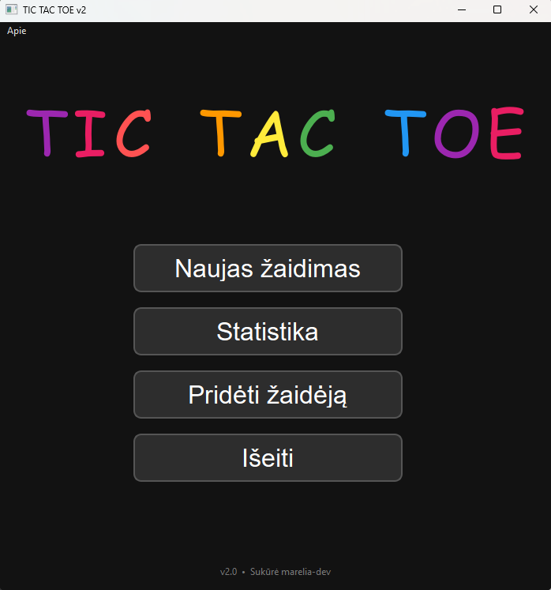

# TIC TAC TOE v2

**Classic Tic-Tac-Toe with a modern graphical interface**

### Features
- Beautiful GUI made with **PyQt6**
- 3 AI difficulty levels:
  - Easy
  - Medium  
  - Hard (Minimax algorithm)
- Player statistics (saved automatically)
- Two-player mode on one computer
- Lithuanian interface + nice emojis

### Screenshot

### How to Run
Just double-click the executable: